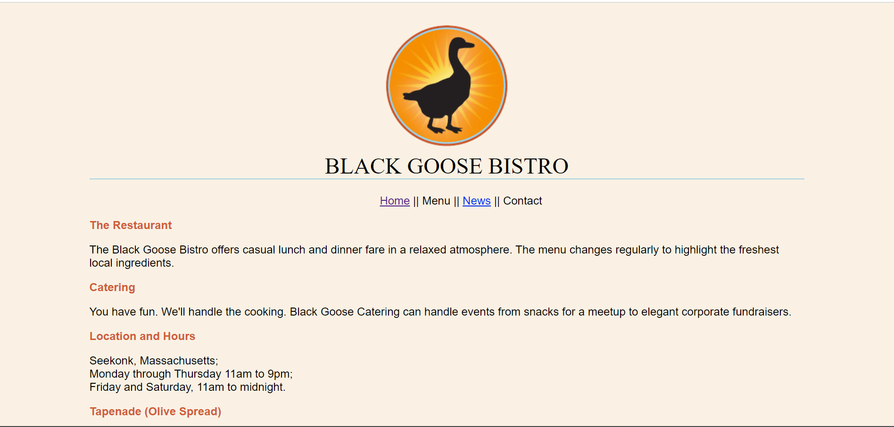

# webDevProjects
My personal web development projects. Some of these projects follow closely with the *Learning Web Design - A Beginner's Guide to HTML, CSS, Javascript, and Web Graphics* textbook by Jennifer Niederst Robbins. The rest are personal projects built for practice. **Unless stated otherwise, these web pages are not hosted publicly on any servers. Furthermore, I used these projects and the textbook for educational purposes ONLY.**

## Screenshots
**bistro/index.html**

## Project Goals/Reflection
* Practice & retain the web development knowledge I learned in college while expanding and learning new skills
  * HTML
  * CSS
  * Javascript
* Practice using Git Bash and basic version control principles
* Build a Web Development portfolio for potential employers in the future
